# Python Threading: Basic to Advanced

A reference guide covering Python's `threading` module — when to use it, when not to, and the concurrency primitives you'll actually need in production.

Sometimes threads might not produce print statements correctly, you you can use this hack:
```python
import sys
print = lambda x: sys.stdout.write("%s\n" % x)
```
---

## Table of Contents

1. [What Are Threads?](#1-what-are-threads)
2. [When to Use Threads (I/O vs CPU & the GIL)](#2-when-to-use-threads-io-vs-cpu--the-gil)
3. [Thread Without `join()`](#3-thread-without-join)
4. [Thread With `join()`](#4-thread-with-join)
5. [Thread With Input Arguments](#5-thread-with-input-arguments)
6. [Multithreading (Multiple Threads)](#6-multithreading-multiple-threads)
7. [Daemon Threads](#7-daemon-threads)
8. [Thread Synchronization With Locks](#8-thread-synchronization-with-locks)
9. [Thread Communication via Queue](#9-thread-communication-via-queue)
10. [Thread Pool Executor](#10-thread-pool-executor)
11. [Thread Events](#11-thread-events)
12. [Speed Comparison: I/O Task](#12-speed-comparison-io-task)
13. [Speed Comparison: CPU Task (Threading vs Multiprocessing)](#13-speed-comparison-cpu-task-threading-vs-multiprocessing)

---

## 1. What Are Threads?

Threads let one process run multiple tasks concurrently while sharing the same memory space. No IPC overhead — variables defined in the main thread are directly visible to spawned threads.

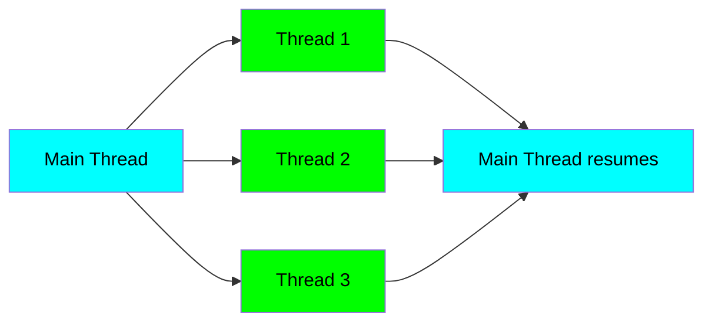

Key properties:
- **Shared memory** — no serialization needed between threads
- **Lightweight** — cheaper than processes to spawn
- **Concurrent, not (in CPython) truly parallel** — see GIL below

---

## 2. When to Use Threads (I/O vs CPU & the GIL)

**The Global Interpreter Lock (GIL)** in CPython allows only one thread to execute Python bytecode at a time. So:

| Workload | Use Threads? | Why |
|----------|-------------|-----|
| I/O-bound (HTTP, disk, DB) | ✅ Yes | GIL released during I/O wait → real concurrency |
| CPU-bound (math, parsing, compression) | ❌ No | GIL serializes; use `multiprocessing` instead |

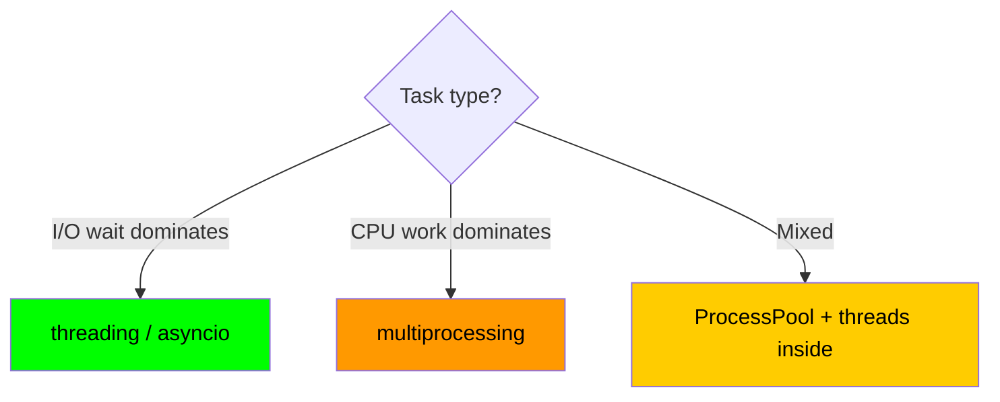

> **Note (forward-looking):** PEP 703 free-threaded CPython (3.13+ experimental, 3.14 mainstream) removes the GIL optionally, making threads viable for CPU work too — at the cost of stricter locking discipline.

---

## 3. Thread Without `join()`

If you don't `join()`, the main thread doesn't wait — it may finish before the spawned thread does.

```mermaid
gantt
    title No join() — main can outrun the thread
    dateFormat X
    axisFormat %s
    section Main
    Main Thread :0, 2
    section Spawned
    Thread (still running)  :0, 8
```

```python
import threading, time

def task():
    time.sleep(2)
    print("task done")

t = threading.Thread(target=task)
t.start()
print("main done")   # prints immediately; "task done" arrives later
```

---

## 4. Thread With `join()`

`join()` blocks the caller until the target thread terminates.

```mermaid
gantt
    title With join() — main waits
    dateFormat X
    axisFormat %s
    section Main
    Main (before) :0, 2
    Main (after join) :8, 10
    section Spawned
    Thread :2, 8
```

```python
t = threading.Thread(target=task)
t.start()
t.join()              # block here until task() returns
print("main done")    # always prints last
```

---

## 5. Thread With Input Arguments

Pass arguments through `args=(...)` (tuple) or `kwargs={...}` (dict). Don't *call* the function — pass the reference.

```python
def greet(name, times):
    for _ in range(times):
        print(f"hi {name}")

t = threading.Thread(target=greet, args=("Yasir", 3))
t.start()
t.join()
```

Gotcha: `args=("Yasir")` is a string, not a tuple. Use `args=("Yasir",)` for a single argument.

---

## 6. Multithreading (Multiple Threads)

Spawn N threads, start them all, join them all.

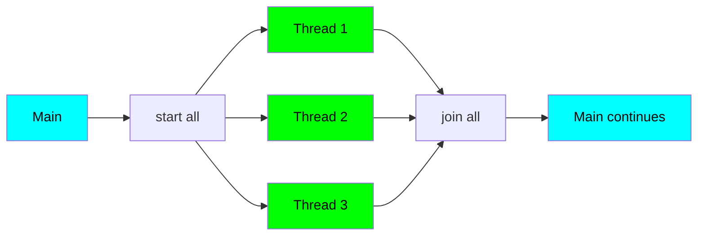

```python
threads = [threading.Thread(target=task, args=(i,)) for i in range(3)]
for t in threads: t.start()
for t in threads: t.join()
```

---

## 7. Daemon Threads

Daemon threads die automatically when the main thread exits. Use for background work that shouldn't keep the process alive (heartbeats, log flushers, telemetry).

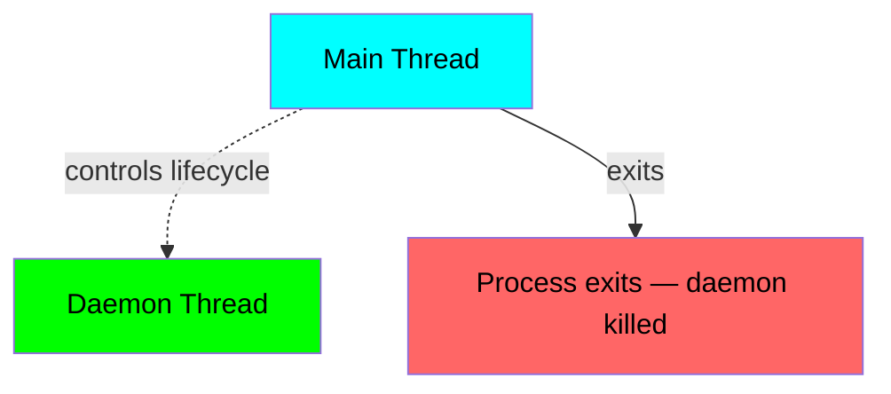

```python
t = threading.Thread(target=heartbeat, daemon=True)
t.start()
# no join — when main returns, t is terminated
```

Caveat: daemon threads are killed abruptly — no cleanup, no `finally` blocks guaranteed. Don't hold critical state in them.

---

## 8. Thread Synchronization With Locks

Multiple threads writing to shared state → race conditions. The GIL does NOT save you — it can switch threads mid-statement (between bytecodes).

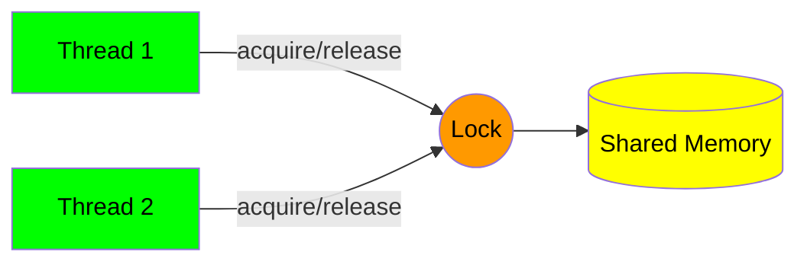

```python
lock = threading.Lock()
counter = 0

def increment():
    global counter
    for _ in range(100_000):
        with lock:           # context manager auto-releases
            counter += 1
```

Without the lock, `counter += 1` (LOAD → ADD → STORE bytecodes) is non-atomic and you'll lose updates.

---

## 9. Thread Communication via Queue

`queue.Queue` is thread-safe out of the box — no manual locks needed. Classic producer/consumer.

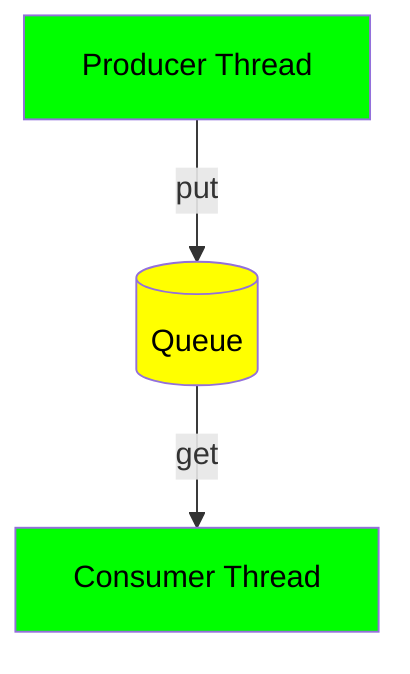

```python
import queue, threading

q = queue.Queue()

def producer():
    for i in range(5):
        q.put(i)
    q.put(None)            # sentinel to signal end

def consumer():
    while True:
        item = q.get()
        if item is None: break
        print(item)
        q.task_done()

threading.Thread(target=producer).start()
threading.Thread(target=consumer).start()
```

Use when threads operate at different speeds — the queue absorbs the imbalance (bounded `Queue(maxsize=N)` applies backpressure).

---

## 10. Thread Pool Executor

`ThreadPoolExecutor` manages a fixed pool — submit work, get futures, no manual `start`/`join`.

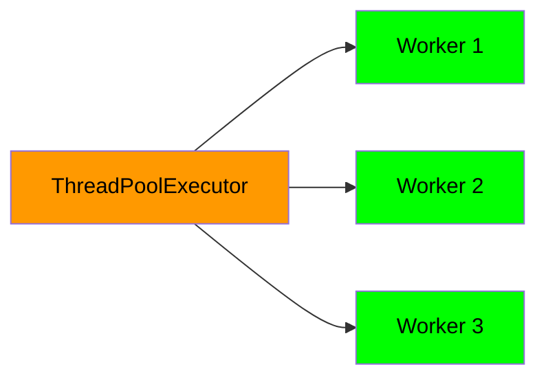

```python
from concurrent.futures import ThreadPoolExecutor

urls = ["https://a.com", "https://b.com", "https://c.com"]

with ThreadPoolExecutor(max_workers=5) as pool:
    results = list(pool.map(requests.get, urls))
# context exit blocks until all tasks complete
```

Prefer this over raw `threading.Thread` for bounded concurrency. Use `submit()` + `as_completed()` when you want results as they finish rather than in order.

---

## 11. Thread Events

`threading.Event` = boolean flag + parking lot. One thread waits, another signals.

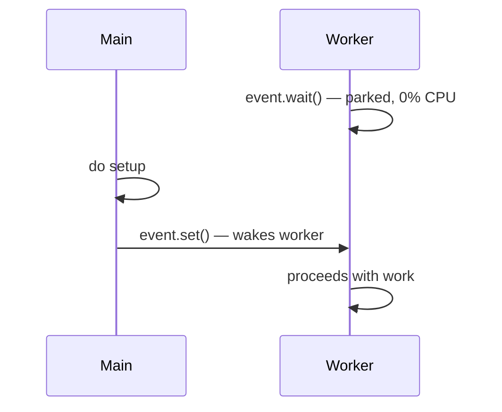

```python
event = threading.Event()

def worker():
    event.wait()           # blocks (no CPU burn) until set()
    print("go!")

t = threading.Thread(target=worker)
t.start()
time.sleep(2)
event.set()                # release the worker
```

Why not just a global flag + `while not flag: pass`? Busy-waits burn a core. Event uses an OS condition variable — kernel parks the thread until signaled.

Useful methods: `set()`, `clear()`, `wait(timeout=...)`, `is_set()`.

---

## 12. Speed Comparison: I/O Task

For network/disk-bound work, threading scales near-linearly until you saturate the remote service or the network.

```python
import time, requests
from concurrent.futures import ThreadPoolExecutor

urls = ["https://httpbin.org/delay/1"] * 10

# Sequential: ~10s
t0 = time.time()
for u in urls: requests.get(u)
print(f"sync: {time.time()-t0:.1f}s")

# Threaded: ~1s
t0 = time.time()
with ThreadPoolExecutor(max_workers=10) as pool:
    list(pool.map(requests.get, urls))
print(f"threaded: {time.time()-t0:.1f}s")
```

Why it works: `requests.get` releases the GIL while waiting on the socket. Other threads run during the wait.

---

## 13. Speed Comparison: CPU Task (Threading vs Multiprocessing)

For pure computation, threading gives ~no speedup under the GIL. Multiprocessing sidesteps the GIL by spawning separate interpreters.

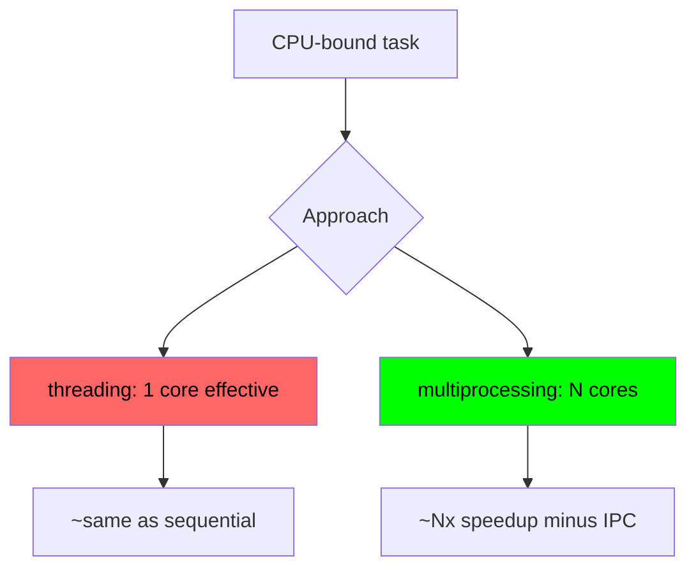

```python
from concurrent.futures import ProcessPoolExecutor

def heavy(n):
    return sum(i*i for i in range(n))

nums = [10_000_000] * 8

with ProcessPoolExecutor() as pool:    # uses all cores
    results = list(pool.map(heavy, nums))
```

Tradeoffs of multiprocessing:
- Args/return values must be picklable
- Higher startup cost per worker
- No shared memory by default (use `multiprocessing.shared_memory` or `Manager` if needed)

---

## Decision Cheat Sheet

| Need | Tool |
|------|------|
| Fan out HTTP calls | `ThreadPoolExecutor` |
| Background heartbeat | daemon `Thread` |
| Shared counter / mutable state | `Lock` (or `queue.Queue`) |
| Producer/consumer pipeline | `queue.Queue` |
| Signal "ready to go" | `Event` |
| CPU-heavy math | `ProcessPoolExecutor` |
| Thousands of concurrent I/O ops | `asyncio` (not threads) |

---

## Gaps worth filling

- `threading.Condition` — wait/notify with predicate. More general than Event; right primitive when Queue doesn't fit.
- `Semaphore` / `BoundedSemaphore` — gating N concurrent ops (conn pools, per-host rate limits).
- `RLock` vs `Lock` — recursive acquisition; matters for re-entrant code paths.
- `Barrier` — rendezvous for N threads.
- `threading.local()` and how it differs from `contextvars.ContextVar` (the latter matters once asyncio enters).
- Race-condition mechanics — why `x += 1` isn't atomic, where the GIL releases (bytecode boundaries, I/O syscalls, `time.sleep`), which dict/list ops are de-facto atomic in CPython and why you still shouldn't rely on it.
- Deadlock patterns — lock ordering, hierarchies, `acquire(timeout=)`.
- Graceful shutdown — poison pill, Event-driven cancellation, draining bounded queues.
- `concurrent.futures` deeper — `as_completed`, exception propagation (futures swallow until `.result()`), `Future.cancel()` only works pre-start, `map` ordering guarantees.
- Asyncio interop — `asyncio.to_thread`, `loop.run_in_executor`, when blocking calls poison an event loop.
- Debugging — `threading.enumerate()`, `faulthandler.dump_traceback_later`, py-spy `dump --pid`, `sys.settrace` for per-thread tracing.
- Free-threaded CPython (PEP 703, 3.13+ `--disable-gil` builds) — changes the threading-vs-multiprocessing calculus for CPU work. Worth a half-day given your eval pipeline could become CPU-bound.

**Exercises, ordered by yield**

1. **Dining philosophers** — write the deadlock, then fix three ways (global ordering, asymmetric pickup, semaphore-gated seating). Teaches deadlock viscerally.
2. **Concurrent scraper with per-domain rate limiting** — `BoundedSemaphore` per domain, shared `ThreadPoolExecutor`, Ctrl+C drains in-flight without dropping. Directly relevant to your Hetzner scraping infra.
3. **Multi-stage pipeline** — N producers → bounded queue → M transformers → bounded queue → 1 writer. Poison pills propagate. Observe backpressure when downstream stalls.
4. **Reader-writer lock from `Condition`** — multiple readers XOR one writer. Then add tests proving writer-starvation under reader-preferring policy. Flip to writer-preferring, observe inverse.
5. **TTL cache** — thread-safe `dict` + background evictor daemon using `Event.wait(timeout)` rather than `sleep` (clean shutdown).
6. **Bank ledger race** — N threads transferring between accounts. Naive impl + invariant test (sum constant). Watch it fail. Fix: lock-per-account, acquire in id-order to avoid deadlock.
7. **Port scanner** — `ThreadPoolExecutor` + `as_completed` with per-future timeout, progress reported from main thread only (never from worker — teaches UI-thread discipline).
8. **Token-bucket rate limiter** — `Condition` + `time.monotonic()`, exposed as context manager. Test under bursty load.
9. **Reimplement `queue.Queue`** — `Lock` + two `Condition`s (not-empty, not-full). Cements why `Condition.wait()` needs a `while predicate:` loop (spurious wakeups, lost-wakeup hazard).
10. **Race-condition fuzzer** — instrument a known-bad function, hammer it under contention until the bug surfaces. Rerun on free-threaded 3.13 build — note which races got worse without the GIL.

**Diagnostic muscle to build alongside**

- Reproduce a deadlock, attach `py-spy dump --pid <PID>`, read the stuck stacks.
- Wrap hangs with `faulthandler.dump_traceback_later(5)` so they auto-confess.
- Write tests that try hard to fail — random sleeps, high thread counts, repeat-until-flake. Most threading bugs hide because the test was too gentle.

**Skip for now**: rolling your own lock from atomics (academic in Python — GIL hides too much), and CPython `_thread.c` source until you've felt the primitives.